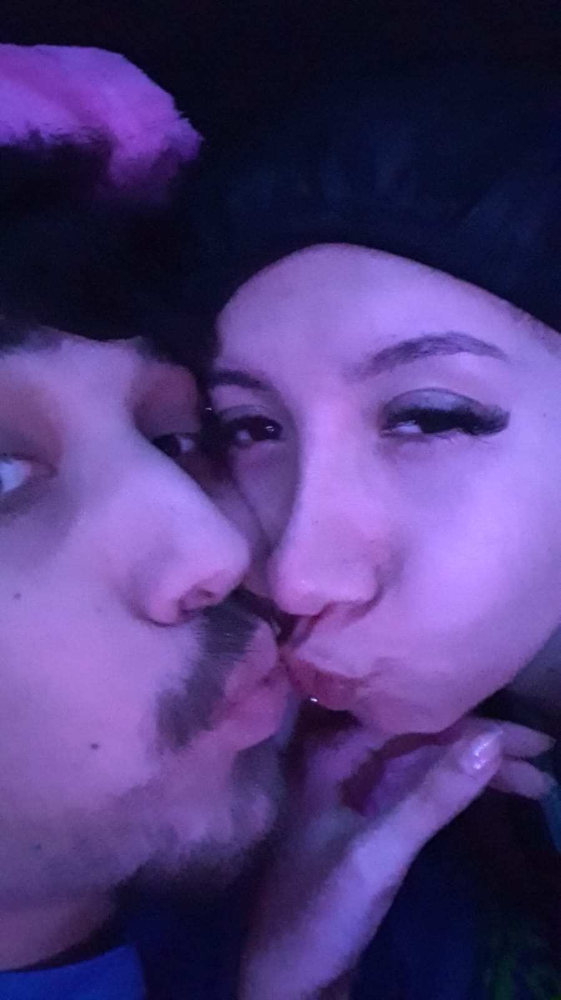
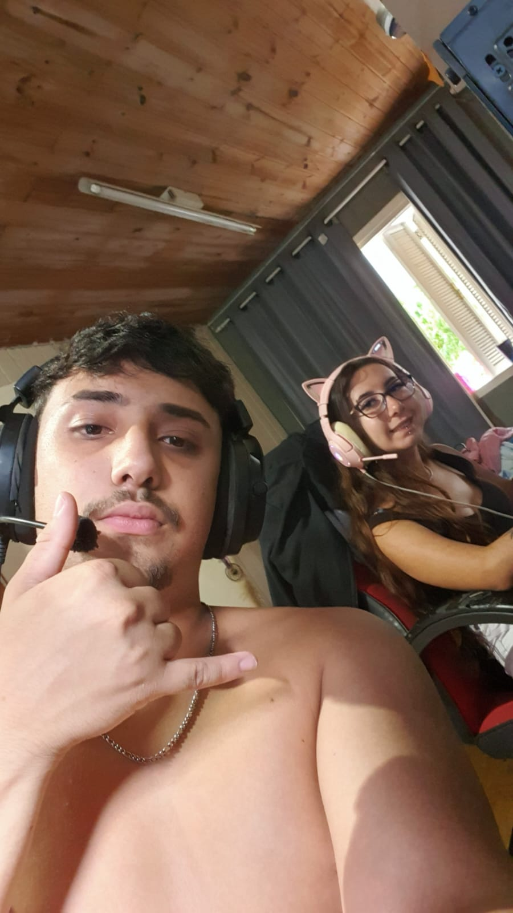
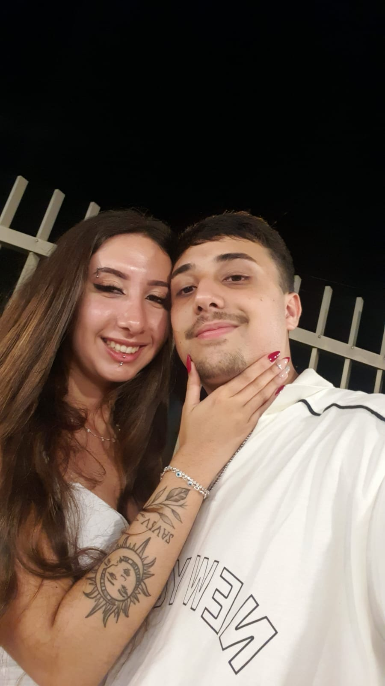

<html lang="pt-BR">
<head>
<meta charset="UTF-8">
<meta name="viewport" content="width=device-width, initial-scale=1.0">
<title>Nosso Save - Evelyn ❤️</title>

</head>
<body>

<h2 style="margin-top:20px">The Sims 4</h2>

Carregando save...

💚 Dica: Evelyn é a Sim favorita do criador deste save.

<h1>Evelyn ❤️</h1>

Bem-vinda ao nosso mundo.

<h2 style="margin:10px 0">3 anos e 7 meses</h2>

Uma surpresa feita especialmente para você.

<button class="btn" onclick="openHouse()">Entrar no Nosso Mundo</button>

<h1>🏡 Nossa Casa</h1>

Escolha um cômodo

📖 História

📸 Fotos

✨ Memórias

❤️ Carta Final

<button class="back" onclick="goHome()">←</button>

<button class="back" onclick="goHome()">←</button>

<h2>Para Evelyn ❤️</h2>
 

Espero que você tenha gostado da surpresa. Sei que foi simples mas pode ter certeza que foi de coração.
Tudo que coloquei aqui foi pensando em nós 2, demorou um tempo para fazer, então espero que curta. Eu te amo muito,
muito mesmo do fundo do meu coração. Espero poder ter muitos mais dias dos namorados com você e porder passar mais anos e
anos contigo, ao teu lado, por enquanto como namorado e futuramente como marido. Você é a garota mais linda do mundo todo. Tudo em você
me deixa bobo. Teu sorriso, teu cabelo, teu corpo todo, seu cheiro maravilhoso e seu jeito de se vertir me deixam loucos.
Não tem o que eu fale aqui nesta carta que possa descrever tudo que sinto por ti. Te amo te amo TE AMO te amo te amo...
Te amoTe amoTe amoTe amoTe amo
Te amo Te amoTe amoTe amoTe amo
Te amo Te amoTe amoTe amoTe amo
Te amo Te amoTe amoTe amoTe amo
Te amo Te amoTe amoTe amoTe amo
Te amo Te amoTe Te amoTe amoTe amo
Te amo Te amo
Te amo Te amo
Te amo 
Te amoTe amoTe amo
Te amo Te amo 
Te amo
Te amo 
Te amo
Te amo
Te amo 
Te amo
Te amo 
Te amo
Te amo 
Te amo
Te amo
Te amo 
Te amo
Te amo 
Te amo
Te amo 
Te amo
Te amo 
Te amo
Te amo
Te amo 
Te amo
Te amo
Te amo Te amo 
Te amo
Te amo
Te amo 
Te amo
Te amo
Te amo 
Te amo
Te amo
Te amo 
Te amo
Te amoTe amo 
Te amo
Te amo
Te amo 
Te amo
Te amo
Te amo 
Te amo
Te amo
Te amo 
Te amo
Te amoTe amo 
Te amo
Te amo
Te amo 
Te amo
Te amo
Te amo 
Te amo
Te amo
Te amo 
Te amo
Te amo
Te amo
Te amo
Te amo 
Te amo
Te amo
Te amo 
Te amo
Te amo
Te amo 
Te amo
Te amo

</body>
</html>
